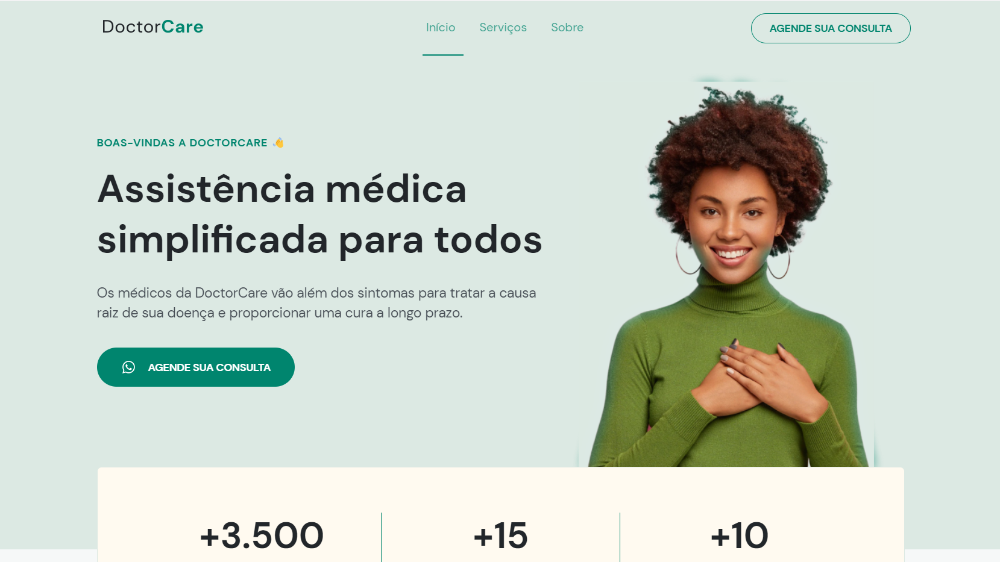

# DoctorCare

  

## 📑 Description

 This project was created during the Next Level Week - NLW Return, an event developed by Rocketseat.

The Doctor Care application is the final project of the Origin Mission.

## 🔗 Functions

DoctorCare is a responsive institutional page, in "one page" format, which was divided into the following sections: Header, Navigation, Home, Services, About, Contact and Footer.
 

 This template can be used for any type of business.

## 💻 Language and Tools

For the development of this project, the following languages and tools were used:

- [HTML](https://developer.mozilla.org/pt-BR/docs/Web/HTML)
- [CSS](https://developer.mozilla.org/pt-BR/docs/Web/CSS)
- [JavaScript](https://developer.mozilla.org/pt-BR/docs/Web/JavaScript)

## 🚀 Deploy

Click on the link below to access the project 👇🏾

- [DoctorCare](https://hrodrigomota.github.io/doctor-care/)
